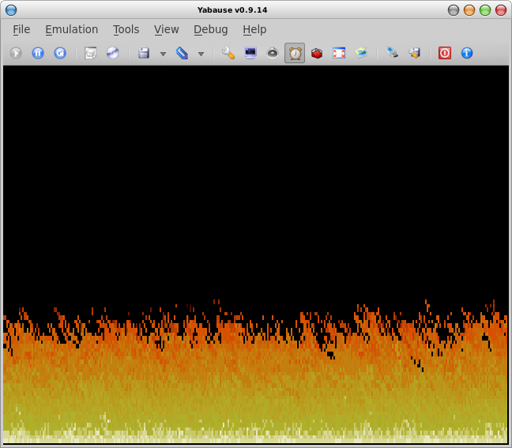

# DoomFS2

A reimplementation of the [DOOM engine](https://en.wikipedia.org/wiki/Doom_(1993_video_game)) for the [Sega Saturn console](https://en.wikipedia.org/wiki/Sega_Saturn) built around the [Jo engine](https://www.jo-engine.org/).

## Background

The Sega Saturn recieved an [official port of DOOM](https://doom.fandom.com/wiki/Sega_Saturn) which suffered from a very low frame rate. The hardware appears well-suited to the mixure of pseudo-3D and sprite based rendering but the [developer was instructed](https://fabiensanglard.net/doom_psx/) to perform a straight up port of the game without using VDP1 and VDP2's custom 3D video acceleration, relying on software rendering on the two SH-2 processors instead. As an exercise in exploring the Saturn's hardware I feel performing a similar port - one which will make greater use of the graphics hardware - would be the best way to get hands on experience with the platform. With a little luck, we may even get some playable levels out of the project. :)

## Resources

In an act that was unusually enlightened for the time, id software released the source code for DOOM. As a result there are many in-depth resources, including the source code for numerous other ports, which elucidate how the DOOM engine works. A few which I've found especially useful for this effort are:

* [Fabien Sanglard's excellent website](https://fabiensanglard.net/)
* [Fabien Sanglard's even more excellent book dedicated specifically to the DOOM engine](https://fabiensanglard.net/gebbdoom/)
* [The original DOOM source code](https://github.com/id-Software/DOOM)
* [Michael Abrash's book The Zen of Graphics Programming](https://www.amazon.com/Zen-Graphics-Programming-2nd-Applications/dp/1883577896/)
* [The decompiled and annotated PSX source code](https://github.com/Erick194/PSXDOOM-RE)

## Build instructions

1. Install the [Jo engine](https://www.jo-engine.org/) SDK and checkout this code under its `Projects` directory. 
2. Add the PSX DOOM WAD content to the cd directory.
3. Run the `compile.sh` script.
